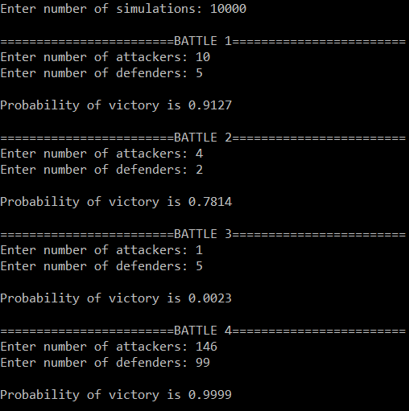

Projects
========

<a href="https://azhb.github.io/projects/3DGolf"> Golf in 3D </a>
--------

<a href="https://azhb.github.io/projects/2DGolf"> Golf in 2D </a>
--------

<a href="https://azhb.github.io/projects/risk"> A Game of Risk </a>
--------

### About
A C++ console-application implementation of an algorithm that I wrote to calculate the probability of a victory in a battle in the renowned board game Risk. The algorithm estimates the problability of a victory by using a Monte-Carlo method, involving the repeated random sampling of a probability distribution to estimate the outcome of dice rolls and simulate thousands of possible outcomes.

### Motivation
