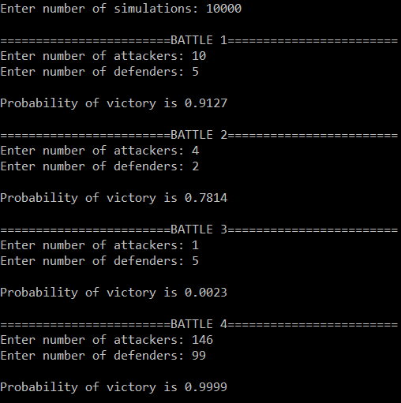

<h1> A Game of Risk </h1>

This project showcases a C++ implementation of an algorithm that simulates the probability of victory in any given battle in the board game Risk. The algorithm is based on a Monte-Carlo approach, involving the efficient simulation of thousands of rounds by emulating dice rolls using repeated random draws from a probability distribution. An accurate result is calculated efficiently and almost instantaneously even for battles with thousands of dice rolls. The resulting console application was swiftly (and rightfully) banned by friends and family!

<div class="center">
<table>
	<td style="width:320px">  </td> 
	<td style="width:320px">  </td>
</table>
</div>

<h2> The Rules </h2>

To provide some context on the inner workings of the algorithm, it is useful to briefly outline the rules that determine the victor in a battle in Risk.

<h2> Algorithm Overview </h2>

Monte carlo method
psuedocode

<h2> Code Breakdown </h2>

<p> Generating Dice Rolls</p>

```cpp
//Generate random dice rolls
vector<int> aRolls(aDice);
vector<int> dRolls(dDice);
for(vector<int>::iterator it=aRolls.begin();it!=aRolls.end();it++){
	*it = rand() % 6 + 1;
}
for(vector<int>::iterator it=dRolls.begin();it!=dRolls.end();it++){
	*it =rand() % 6 + 1;
}
```
<p> Sorting Dice Rolls </p>

```cpp
//Sort random dice rolls for comparison
sort(aRolls.begin(),aRolls.end());
reverse(aRolls.begin(),aRolls.end());
sort(dRolls.begin(),dRolls.end());
reverse(dRolls.begin(),dRolls.end());
```

<p>Calculating result</p>

```cpp
//Calculate damage to attacker and defender
int battles = min(aRolls.size(),dRolls.size());
for(int i=0;i!=battles;i++){
	if(aRolls[i]>dRolls[i]){
		dCopy--;
	}
	else{
		aCopy--;
	}	
}
```

<h2> Running Time Analysis </h2>

